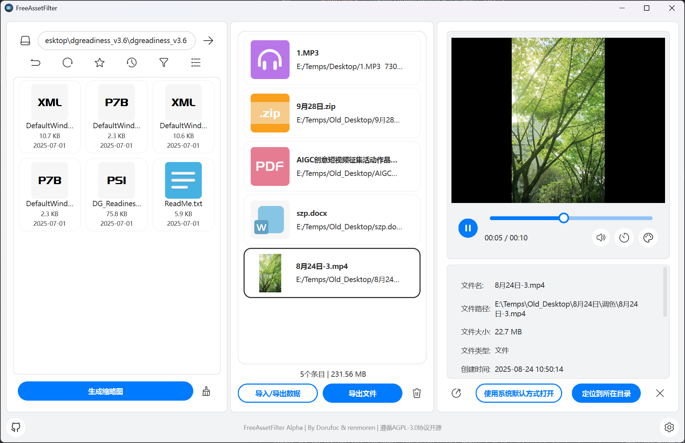

<div align="center">


# FreeAssetFilter

**A powerful multi-functional file preview and management tool that makes file browsing silky smooth and efficient**

[](https://github.com/Dorufoc/FreeAssetFilter/releases)
[](https://www.python.org/)
[](https://wiki.qt.io/Qt_for_Python)  
[](LICENSE)
[](https://www.microsoft.com/windows)

[中文](README.md) • [Feature Preview](#feature-preview) • [Quick Start](#quick-start) • [Features](#features) • [Installation Guide](#installation-guide) • [Usage Guide](#usage-guide) • [Technical Architecture](#technical-architecture) • [Development Guide](#development-guide) • [Contributing Guide](#contributing-guide)



</div>

---

## Feature Preview

### Core Highlights

- **Lightning Fast Startup** - Optimized preloading mechanism for instant launch experience
- **Professional Preview** - Supports 100+ file formats, covering images, videos, audio, and documents
- **Three-Column Layout** - Efficient workflow combining file browsing, filtering, and preview
- **Dark Mode** - Support for dark/light theme switching to protect your eyes
- **High Performance** - C++ core algorithms + asynchronous loading for smooth performance

---

## Quick Start

### System Requirements

| Item | Requirement |
| ------------------ | ---------------------------------- |
| **Operating System** | Windows 10/11 (64-bit) |
| **Python** | 3.9 or higher |
| **Memory** | 4GB RAM recommended |
| **Graphics Card** | OpenGL-compatible GPU (for video playback) |

### One-Click Installation

```bash
# Clone the repository
git clone https://github.com/Dorufoc/FreeAssetFilter.git
cd FreeAssetFilter

# Create virtual environment (recommended)
python -m venv venv
venv\Scripts\activate

# Install dependencies
pip install -r requirements.txt

# Run the application
python -m freeassetfilter.app.main
```

### FAQ

<details>
<summary><b>Missing DLL file error on startup?</b></summary>

Please install [Visual C++ Redistributable](https://aka.ms/vs/17/release/vc_redist.x64.exe) and try again.

</details>

<details>
<summary><b>Video playback not working?</b></summary>

Please ensure your graphics drivers are up to date and support OpenGL 3.0 or higher.

</details>

<details>
<summary><b>Installation dependency errors requiring compilation tools?</b></summary>

Some packages (such as `rawpy`, `numpy`) require local compilation. Please ensure you have one of the following tools installed:

**Option 1: Install Microsoft C++ Build Tools (Recommended)**

1. Download [Microsoft C++ Build Tools](https://visualstudio.microsoft.com/visual-cpp-build-tools/)
2. Install the "Desktop development with C++" workload
3. Re-run `pip install -r requirements.txt`

**Option 2: Use Pre-compiled Wheel Packages**

```bash
# Upgrade pip first
python -m pip install --upgrade pip

# Use mirror to accelerate download of pre-compiled packages if needed
pip install -r requirements.txt -i https://pypi.tuna.tsinghua.edu.cn/simple
```

**Option 3: Install Visual Studio (Full Version)**

- Install [Visual Studio Community](https://visualstudio.microsoft.com/downloads/)
- Select the "Desktop development with C++" component

</details>

---

## Features

### File Management

| Feature | Description |
| ------------------------ | ------------------------------------ |
| **Smart File Browser** | Card layout with thumbnail display for intuitive and efficient browsing |
| **File Staging Pool** | Quickly collect and organize selected files with batch export support |
| **Multi-select & Drag** | Support for multi-file selection and long-press drag operations |
| **Path Navigation** | Quick directory switching, history, and path bookmarks |
| **Smart Filtering** | Quick filtering by file type, date, and size |

### File Preview

| Type | Supported Formats | Special Features |
| ---------------- | ---------------------------------------- | ---------------------- |
| **Images** | JPG, PNG, GIF, RAW, PSD, HEIC, AVIF, SVG | Easy viewing, color analysis |
| **Videos** | MP4, MOV, AVI, MKV, MXF | MPV core, LUT real-time preview |
| **Audio** | MP3, WAV, FLAC, OGG, AAC | Metadata display, efficient playback |
| **Documents** | PDF, DOCX, XLSX, PPTX, TXT, MD | Full preview, code syntax highlighting |
| **Archives** | ZIP, RAR, 7Z, TAR | View contents without extraction |
| **Fonts** | TTF, OTF, WOFF | Real-time rendering preview |

### Personalization Settings

- **Theme System** - Dark/Light mode with custom color scheme support
- **DPI Adaptive** - Perfect support for 4K/8K high-resolution displays
- **Font Settings** - Customizable interface fonts and sizes
- **Thumbnail Cache** - Smart caching mechanism to improve browsing speed

### Performance Optimization

- **Asynchronous Loading** - Thumbnails generated in background without blocking the main thread
- **C++ Extensions** - Core algorithms implemented in C++ for excellent performance
- **Memory Management** - Smart cache cleanup to optimize memory usage
- **Startup Acceleration** - Preloading mechanism for fast application launch

### Feature Comparison

| Feature | FreeAssetFilter | QuickLook | Seer | Explorer |
| -------- | --------------- | ----------- | ----------- | --------- |
| Image Preview | 100+ formats | Common formats | Common formats | Limited |
| Video Playback | Built-in player | Plugin required | Plugin required | Not supported |
| RAW Support | Full support | Partial | Partial | Not supported |
| PSD Preview | Layer support | Not supported | Not supported | Not supported |
| LUT Preview | Real-time | Not supported | Not supported | Not supported |
| Layout | Three-column | Not supported | Not supported | Supported |
| Open Source | AGPL-3.0 | GPL | Paid | Supported |

---

## Supported Formats

### Image Formats (30+)

| Category | Formats |
| ------------------ | ------------------------------------------------ |
| **Common** | JPG, JPEG, PNG, GIF, BMP, WEBP, TIFF, SVG |
| **Modern** | AVIF, HEIC, HEIF, JP2, JXR |
| **RAW** | CR2, CR3, NEF, ARW, DNG, ORF, RAF, RW2, PEF, X3F |
| **Professional** | PSD, PSB, XCF, TGA, ICO, ICNS, DDS |

### Video Formats (20+)

| Category | Formats |
| ------------------ | ---------------------------------------- |
| **Common** | MP4, MOV, AVI, MKV, WMV, FLV, WEBM |
| **Professional** | MXF, VOB, M2TS, TS, MTS, M2T, DV, ProRes |
| **Mobile** | 3GP, M4V, MPEG, MPG, HEVC, H.264 |

**Video Features**:

- High-performance playback based on MPV
- Support for LUT (.cube) real-time color grading
- Speed control
- Volume control

### Audio Formats (10+)

MP3, WAV, FLAC, OGG, WMA, AAC, M4A, OPUS, AIFF, APE, MKA, AC3

**Audio Features**:

- Metadata display (ID3, album art)
- Modern background styling

### Document Formats (50+)

| Category | Formats |
| ---------------------------------- | --------------------------------------------------- |
| **PDF** | PDF (full preview, zoom) |
| **Office (requires separate plugin)** | DOC, DOCX, XLS, XLSX, PPT, PPTX |
| **Text** | TXT, MD, RST, RTF, CSV, JSON, XML, YAML |
| **Code** | Python, JavaScript, C++, Java, Go, Rust, etc. 50+ languages |

### Archive Formats (10+)

ZIP, RAR, 7Z, TAR, GZ, BZ2, XZ, LZMA, ISO, CAB, ARJ

### Font Formats (5+)

TTF, OTF, WOFF, WOFF2, EOT

---

## Installation Guide

### Method 1: Pre-compiled Version (Recommended)

Download the latest pre-compiled version:

- [Download Windows Installer](https://github.com/Dorufoc/FreeAssetFilter/releases)

### Method 2: Install from Source

#### 1. Clone the Repository

```bash
git clone https://github.com/Dorufoc/FreeAssetFilter.git
cd FreeAssetFilter
```

#### 2. Create Virtual Environment

```bash
python -m venv venv
venv\Scripts\activate  # Windows
```

#### 3. Install Dependencies

```bash
pip install -r requirements.txt
```

#### 4. Build C++ Extensions (Optional, for LUT color grading, pre-compiled cp39-x64 version included in source)

```bash
# Build color extraction module
cd freeassetfilter/core/cpp_color_extractor
python setup.py build_ext --inplace

# Build LUT preview module
cd ../cpp_lut_preview
python setup.py build_ext --inplace
```

#### 5. Run the Application

```bash
python -m freeassetfilter.app.main
```

### Detailed System Requirements

| Component | Minimum Requirements | Recommended Configuration |
| ------------------ | --------------------------- | --------------------------- |
| **Operating System** | Windows 10 | Windows 11 |
| **Processor** | Intel Core i3 / AMD Ryzen 3 | Intel Core i5 / AMD Ryzen 5 |
| **Memory** | 4 GB RAM | 8 GB RAM |
| **Storage** | 900MB available space | 1 GB available space |
| **Graphics Card** | Modern integrated GPU with video acceleration | Nvidia/AMD modern discrete GPU |

---

## Usage Guide

### Interface Layout

```
┌─────────────────┬─────────────────┬─────────────────┐
│                 │                 │                 │
│  File Selector  │  File Staging   │  File Previewer │
│    (30%)        │    (30%)        │    (40%)        │
│                 │                 │                 │
│  • Browse       │  • Collect      │  • Real-time    │
│  • Thumbnails   │  • Batch manage │  • Details      │
│  • Quick filter │  • Export       │  • Full screen  │
│                 │                 │                 │
└─────────────────┴─────────────────┴─────────────────┘
```

### Basic Operations

| Default Action | Description |
| ------------------ | ---------------- |
| **Left Click** | Select file and preview |
| **Right Click** | Open context menu |
| **Long Press Drag** | Drag file to staging pool |

### File Selector

- **Navigation Bar**: Quick directory switching, go up, refresh list
- **Filter**: Quick filter by file type (Image/Video/Audio/Document/All)
- **Sort**: Sort by name, date, size, type
- **View Mode**: Thumbnail/List mode toggle

### File Staging Pool

- **Add Files**: Drag from selector or click add button
- **Clear Pool**: One-click to clear all files
- **Export/Import Data**: Save/load selected file path data
- **Export Files**: Export selected files to specified directory

### File Previewer

- **Adaptive Layout**: Automatically adjusts based on content type
- **Detailed Info**: Display file metadata
- **Action Buttons**: Open, copy file, show in folder

## Technical Architecture

### Core Technology Stack

```
FreeAssetFilter
├── GUI Framework: PySide6 (Qt6) - Cross-platform GUI
├── Image Processing: Pillow + rawpy - Image decoding and processing
├── Video Playback: MPV (libmpv) - High-performance video playback
├── Audio Processing: mutagen - Metadata reading
├── Archives: 7z.exe command-line tool - Archive file handling
├── Syntax Highlighting: Syntect + Pygments - Code syntax highlighting
└── Extensions: C++/Rust (color extraction, thumbnails, LUT processing) - Performance-critical algorithms
```

### Project Structure

```
FreeAssetFilter/
├── freeassetfilter/
│   ├── app/                    # Application entry point
│   │   └── main.py            # Main program
│   ├── components/            # UI components
│   │   ├── file_selector.py   # File selector
│   │   ├── unified_previewer.py # Unified previewer
│   │   ├── file_staging_pool.py # File staging pool
│   │   ├── video_player.py    # Video player
│   │   ├── photo_viewer.py    # Image viewer
│   │   ├── pdf_previewer.py   # PDF previewer
│   │   └── ...                # Other components
│   ├── core/                  # Core modules
│   │   ├── settings_manager.py    # Settings management
│   │   ├── thumbnail_manager.py   # Thumbnail management
│   │   ├── theme_manager.py       # Theme management
│   │   ├── mpv_player_core.py     # MPV playback core
│   │   ├── svg_renderer.py        # SVG rendering
│   │   ├── cpp_color_extractor/   # C++ color extraction
│   │   └── cpp_lut_preview/       # C++ LUT preview
│   ├── icons/                 # Icon resources
│   ├── utils/                 # Utility functions
│   │   ├── path_utils.py      # Path handling
│   │   ├── icon_utils.py      # Icon handling
│   │   └── syntax/            # Syntax highlighting definitions
│   └── widgets/               # Custom widget library
├── data/                      # Data directory
│   ├── settings.json          # User settings
│   └── thumbnails/            # Thumbnail cache
├── requirements.txt           # Python dependencies
├── README.md                  # Project documentation
└── LICENSE                    # License
```

### Architecture Features

- **MVC Pattern**: Clear separation of Model-View-Controller
- **Singleton Pattern**: Core managers (settings, thumbnails, player)
- **Signal-Slot Mechanism**: Loose coupling communication between components
- **Multi-threaded Design**: Background processing without blocking UI
- **Plugin Components**: Easy to extend support for new file types

---

## Development Guide

### Development Environment Setup

#### 1. Clone Repository and Create Branch

```bash
git clone https://github.com/Dorufoc/FreeAssetFilter.git
cd FreeAssetFilter
git checkout -b feature/your-feature-name
```

#### 2. Install Development Dependencies

```bash
python -m venv venv
venv\Scripts\activate
pip install -r requirements.txt
```

#### 3. Configure IDE

VS Code or PyCharm is recommended with the following plugins:

- Python extension
- Qt for Python extension
- Black formatter

### Build C++ Extensions

```bash
# Build color extraction module
cd freeassetfilter/core/cpp_color_extractor
python setup.py build_ext --inplace

# Build LUT preview module
cd ../cpp_lut_preview
python setup.py build_ext --inplace
```

### Code Standards

- **Type Annotations**: Add type annotations to all functions
- **Docstrings**: Use Google Style Docstrings
- **Naming Conventions**:
  - Class names: PascalCase
  - Functions/Variables: snake_case
  - Constants: UPPER_SNAKE_CASE

### Package Application

```bash
# Using PyInstaller (recommended, better stability)
python Pyinstall_build.py

# Using Nuitka
python Nuitka_build.py
```

### Add New File Preview Support

1. **Create Previewer Component** Create a new previewer class in the `components/` directory:

```python
from PySide6.QtWidgets import QWidget

class NewFormatPreviewer(QWidget):
    def __init__(self, parent=None):
        super().__init__(parent)
        self.init_ui()
  
    def init_ui(self):
        # Initialize UI
        pass
  
    def set_file(self, file_info: dict):
        """Set the file to preview"""
        file_path = file_info['path']
        # Implement file loading logic
        pass
```

2. **Register File Type** Register in `components/unified_previewer.py`:

```python
self.previewers = {
    # ... existing previewers
    '.newext': NewFormatPreviewer,
}
```

3. **Add Icon** Add file type icon in the `icons/` directory

---

## Contributing Guide

We welcome all forms of contribution! Whether it's bug fixes, new features, documentation improvements, or issue reports.

### Contribution Process

1. **Fork the Repository** - Click the Fork button in the top right corner
2. **Clone the Repository** - `git clone https://github.com/your-username/FreeAssetFilter.git`
3. **Create Branch** - `git checkout -b feature/AmazingFeature`
4. **Commit Changes** - `git commit -m 'Add some AmazingFeature'`
5. **Push Branch** - `git push origin feature/AmazingFeature`
6. **Create Pull Request** - Submit PR on GitHub

### Code Standards

- Follow PEP 8 code style
- Add type annotations
- Write clear commit messages
- Update relevant documentation
- Add necessary tests

### PR Submission Process

1. Ensure all tests pass
2. Update relevant documentation in README.md
3. Describe changes in the PR description
4. Link related issues (if any)
5. Wait for code review

### Issue Submission Guidelines

- **Bug Report**: Describe the problem, reproduction steps, expected behavior, actual behavior
- **Feature Request**: Describe the feature, use case, expected outcome
- **Question**: Provide detailed environment information and operation steps

---

## Roadmap

### Completed Features

- [X] Basic file browsing and preview
- [X] Image format support (30+ formats)
- [X] Video playback (based on MPV)
- [X] Audio playback and waveform display
- [X] PDF and Office document preview
- [X] Archive browsing
- [X] Font preview
- [X] Dark/Light theme switching
- [X] File staging pool
- [X] Thumbnail cache system

### In Progress

- [ ] Intelligent file export categorization
- [ ] Timeline and intelligent filtering tools
- [X] Stable ISO file preview
- [ ] Plugin system architecture

### Planned Features

- [ ] macOS and Linux support
- [ ] Network file system support (SMB/NFS)
- [ ] AI smart tagging and categorization
- [ ] Collaboration and sharing features
- [ ] Mobile & Web companion apps

### Long-term Vision

Become the most powerful open-source file preview and management tool in the community, providing efficient digital asset management solutions for creative professionals.

---

## Security Notice

### Dependency Security

- All dependencies are from official PyPI repositories
- Regular dependency updates to fix security vulnerabilities
- Use `pip-audit` for dependency security checks

### Vulnerability Reporting

If you discover a security vulnerability, please do not disclose it in a public issue. Send an email to:

dorufoc@outlook.com

We will respond within 48 hours and fix the vulnerability as soon as possible.

---

## License

This project is open-sourced under the [AGPL-3.0](LICENSE) license.

```
FreeAssetFilter - Multi-functional File Preview and Management Tool
Copyright (C) 2025 Dorufoc <qpdrfc123@gmail.com>

This program is free software: you can redistribute it and/or modify
it under the terms of the GNU Affero General Public License as published
by the Free Software Foundation, either version 3 of the License, or
(at your option) any later version.

This program is distributed in the hope that it will be useful,
but WITHOUT ANY WARRANTY; without even the implied warranty of
MERCHANTABILITY or FITNESS FOR A PARTICULAR PURPOSE.  See the
GNU Affero General Public License for more details.
```

---

## Acknowledgments

### Core Dependencies

Thanks to the following open-source projects for their contributions:

#### GUI Framework

- [Qt for Python (PySide6)](https://wiki.qt.io/Qt_for_Python) - Cross-platform GUI framework

#### Image Processing

- [Pillow](https://python-pillow.org/) - Python image processing library
- [pillow-heif](https://github.com/bigcat88/pillow_heif) - HEIF/HEIC format support
- [pillow-avif](https://github.com/python-pillow/Pillow) - AVIF format support
- [rawpy](https://github.com/letmaik/rawpy) - RAW image processing
- [psd-tools](https://github.com/psd-tools/psd-tools) - PSD file parsing

#### Video & Audio

- [MPV](https://mpv.io/) - High-performance video player
- [mutagen](https://mutagen.readthedocs.io/) - Audio metadata processing

#### Document Processing

- [Pygments](https://pygments.org/) - Code syntax highlighting
- [Markdown](https://python-markdown.github.io/) - Markdown parsing

#### Archive Processing

- [7-Zip](https://www.7-zip.org/) - 7z format open source implementation and LZMA/LZMA2 algorithms

#### Syntax Highlighting

- [Syntect](https://github.com/trishume/syntect) - High-performance syntax highlighting engine
- [vscode-textmate](https://github.com/microsoft/vscode-textmate) - TextMate grammar parsing library

#### Scientific Computing

- [NumPy](https://numpy.org/) - Scientific computing library

#### Text & Encoding

- [chardet](https://github.com/chardet/chardet) - Character encoding detection
- [ExifRead](https://github.com/ianare/exif-py) - EXIF data reading

### Resource Acknowledgments

- Fonts: Using [Fira Code](https://github.com/tonsky/FiraCode) as code font
- Chinese Font: Using PangMenZhengDao Title Font

### Special Contributors

Thanks to all developers who have contributed to the project:

- [@Dorufoc](https://github.com/Dorufoc) - Project Founder & Core Developer
- [@renmoren](https://github.com/renmoren) - Core Developer

### Related Projects

- [mpv](https://github.com/mpv-player/mpv) - Command-line video player
- [vscode-textmate](https://github.com/microsoft/vscode-textmate) - TextMate grammar parsing library

---

<div align="center">

**If this project helps you, please give us a Star!**

[Submit Bug](https://github.com/Dorufoc/FreeAssetFilter/issues) • [Feature Request](https://github.com/Dorufoc/FreeAssetFilter/issues) • [Contribute](https://github.com/Dorufoc/FreeAssetFilter/pulls)

Made with love by [Dorufoc](https://github.com/Dorufoc) & [renmoren](https://github.com/renmoren)

</div>
